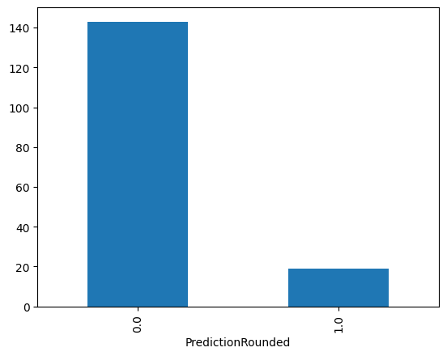
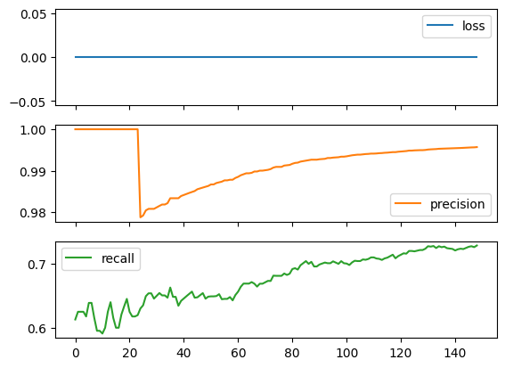
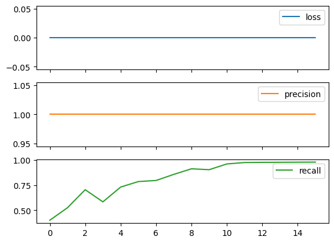

# ASE Assignment 3

## Task 1

Goal: Measure impact of distribution shifts in the `Worker.profession` input feature.

### Dataset preparation

In preparation we split the dataset into "Students" (i.e. "Graduates" and "Undergraduates") and "Non-Students".

We split the "Students" dataset into a training and holdout set by a factor of `0.2`.
To ensure an even distribution of `GroundTruth` values across both sets, we split the "Students" dataset by `GroundTruth` value, and randomly select 20% of each for the holdout set.

### Classifier training

We use the `tfdf` module and train the student classifier using a random forest model with a tuner.

### Classifier evaluation

To evaluate the performance of the student classifier we compile loss, precision, and recall on the holdout (i.e. test) set.

In this instance, the random forest classifier with a tuner running 100 trials, the loss is at `0.0000`, precision is at `1.0000`, and recall is at `0.6129`.

### Predictions

Additionally, we generate a plot to visualize how often the classifier predicted true/false.



### Distribution shifts in holdout set

To explore distribution shifts based on the `Worker.profession` input feature, we gradually add explanations from non-students, split off earlier.

We decided on adding entries in small batches of 10 over a comparatively large number of rounds, 150 in total, while evaluating the changes in loss, precision, and recall after each round.



As is visible on the plots loss remains unchanged across the rounds. This behaviour was consistent across multiple runs of the above randomization. Precision stayed stable at `1.0` for most runs, for a  small number of rounds the precision dropped abruptly, then steadily climbed back up, however the value only ever dropped by at most about `0.02`.

The recall, in contrast, fluctuates a bit more during the first about 25 rounds. In the majority of randomized runs the recall rises steeply or fluctuates around the original value, but never drops far below it. As the rounds go on the value climbs to about, or just above, `0.7` and remains relatively stable towards the end.

### Classifier training while adding non-students

We gradually add non-student entries to the students dataset, and repeatedly train new classifiers on the combined set, in order to determine the impact the non-students have on the classifier performance.

We add non-students entries in batches of 100 over a total of 16 rounds.

Due to the number of rounds we use a tuner with less trials for classifier training. During each round the existing train/test split is kept the same, to which the new entries are being added.



As the above plot shows, the trained classifier steadily increases in accuracy as more non-student entries are added to the dataset. The initial recall is below that of the classifier trained only on student entries above. This discrepancy could be explained by the reduced number of trials used for the tuner during the repeated training of combined classifiers, a number that has been reduced in order to finish the runs in a more permissible timeframe.

Still, even with the comparatively low starting value, the classifiers outperform the classification accuracy we achieved during our previous project. Since we did not split the dataset by method this time, we suspect that the more even split into train/test sets might have a positive impact on the resulting trained classifier.

### Summary

In general, the classifiers trained during Task 1 seemed to perform relatively well, especially in comparison to the classifiers trained on the dataset during the previous assignment.
Interestingly, adding non-student entries to the holdout set of the student-only classifier, as well as adding non-student entries to the training set, seemed to tend towards a positive impact in regards to precision and recall.

Q 1.1: As shown, we did not perceive a strong loss in precision and recall while adding non-student entries to the holdout set. As such we can not make a conclusive statement regarding the degradation.

Q 2.2: Even the student-only classifier outperformed the classifier of our last assignment, so the answer might be 0. Due to the different restrictions, our approach to splitting the dataset could have been favourable in terms of achieving better results, and might explain this fact.

* * * *

## Task 2

Goal: Select minimal number of explanations, so that merging them contains all necessary and sufficient information to understand and fix the bug.

### Approach

We have chosen the bug `HIT01_8` for this task. The following explanation serves as our ground truth benchmark:

```
The specification states, that the method "DateTimeZone()" accepts a minutes offset value in the range of -59 to 59 inlcusive. The method checks if this value, stored as "minutesOffset", is within these bounds on line 279, but incorrectly throws an "IllegalArgumentException" for any minutes offset less than zero instead of less than -59. To fix the issue and satisfy the specification, the conditional on line 279 should check for "minutesOffset < -59" instead.
```

#### LLM

We use the `deepseek-llm:7b` model, which we query via the `REST-API` provided by locally running the model using `Ollama`.

#### Metrics

As our readability and semantic similarity metrics we have chosen the "Flesch reading ease" and "BLEURT" metrics respectively. The former grades how easy an english text is to read on a scale of `0-100`, higher scores meaning a text is more easily readable, while the latter is a regression-model-based metric that compares a candidate text to a reference and returns a score that indicates to what extent the candidate is fluent and conveys the meaning of the reference ([bleurt on github](https://github.com/google-research/bleurt)).

Since the Flesch reading ease grades the readability of a given text, and our ground truth represents an acceptable level of readability (subjectively speaking), the readability score of the generated explanation should be at or above this threshold. A score that is significantly above this threshold, i.e. an explanation that is much easier to read than our ground truth, might not be desirable however, since this could indicate a strong deviation from out ground truth.

The BLEURT scoring metric generates scores between `0.0` and `1.0`, with higher scores indicating, that the candidate shows higher similarity to the reference, our ground truth in this case. As such a higher BLEURT score would be desirable. We think a threshold of `0.75` might be appropriate.

### Prompting

We prompt the model to generate an explanation of the failure, including a fix, based on the given explanations. We prompt the model to present the output in valid json.

During each run we increase the number of explanations given to the model.

In order to choose which explanations we consolidate, we sort by which explanations that pass the readability threshold of `47.12` set by our ground truth have the highest similarity (BLEURT) score.

|index|generated_explanation|readability|bleurt|
|-|-----|-|--|
|28|The error occurs on line 279 when checking if minutesOffset < 0, which is not within the range of -59 to 59 as intended. The check should instead be for minutesOffset < -59.|72.66|0.5155622363090515|
|30|The exception is thrown on line 279 due to the check ""if (minutesOffset < -59 \|\| minutesOffset > 59)"". The variable 'minutesOffset' should be checked for values between -59 and 59, not less than or greater than 0. To fix this, update the check in line 279 to: if (minutesOffset < -59 \|\| minutesOffset > 59). Additionally, note that negative values of 'minutesOffset' are allowed according to documentation.|47.28|0.5128065943717957|
|19|The code is checking if the value of 'minutesOffset' is less than or equal to zero on line 279, which results in rejecting any offset that is less than 0 or greater than 59 and throwing an exception. To fix this issue, change the condition to minutesOFfset < -59.|55.58|0.5101200342178345|
|26|The error occurs on line 279 due to the value of minutesOffset being less than 0, which should be within the range of -59 to 59.|70.47|0.4899592399597168|
|27|The error is occurring on line 279 because the variable minutesOffset, which is set to -15, is less than 0. The conditional clause for minutesOffset being less than 0 is throwing an exception as it's not within the valid range of 0-59.|58.62|0.4820108413696289|
|23|The error is occurring on line 279 due to the value of -15 for minutesOffset, which is less than 0. The conditional statement should be checked for if(minutesOffset < -59 \|\| minutesOffset > 59) instead of simply checking if(minutesOffset < 0). Additionally, as per comments above line 279, the valid range for minutes offset is between -59 and 59.|52.9|0.4768403172492981|
|22|The error is occurring on line 279 due to the value of -15 for minutesOffset, which is less than 0. The conditional statement should check if minutesOffset < -59 or minutesOffset > 59 instead.|55.24|0.47551828622817993|
|16|The given error occurs at line 279 when the minutesOffset value is less than zero, which results in rejecting a negative offset that is not within range (0 to 59).|49.49|0.4625518321990967|
|4|The conditional statement on line 279 is checking if the minuteOffset value is less than zero, but it should also check for values greater than or equal to 59. Therefore, minutesOffset should be checked between -59 and +59.|60.65|0.46184098720550537|
|5|The given negative minuteOffset value (-15) is causing the conditional clause to check for values between 0 and 59, leading it to throw an IllegalArgumentException when passed any offset less than -59 or greater than 59.|34.94|0.4587913751602173|
|14|The error occurs when the value of minutesOffset is less than 0. The code specifically encounters the error on line 279 when it tests if minutesOffset < 0.|57.77|0.45816171169281006|
|3|The issue lies within the conditional statement which checks if minuteOffset is between 0 and 59, not considering negative values. This causes an error for any input less than or equal to -1.|46.27|0.4577632546424866|
|8|The conditional clause checks if the value of `minutesOffset` is greater than or equal to 0, but it throws an exception when a negative value such as -15 is passed in. The correct range for the `minutesOffset` should be between 0 and 59.|66.57|0.4522724151611328|
|21|The error is occurring on line 279 due to the value of -15 being passed as minutesOffset, which is less than 0 and out of range for the conditional statement ""if (minutesOffset < -59 \|\| minutesOffset > 59)"". The correct values should be within the ranges of -59 to +59.|56.08|0.4479660987854004|
|20|The code checks if the value of minutesOffset < -59 or > 59, which rejects any offset that is less than 0 or greater than 59, resulting in an exception being thrown on line 280.|54.9|0.44428956508636475|
|15|The code throws an exception when the value for `minutesOffset` is less than 0, but it does not properly consider negative values for both minutes and hours.|44.07|0.4421396851539612|
|13|The software failure occurs when the value of ""-15"" is passed as ""minutesOffset"", which has less than 0, causing an exception on line 280 due to incorrect validation checks in conditional statements at line 279.|44.41|0.4393938183784485|
|18|The code checks if the value of 'minutesOffset' is less than 0 or greater than 59, which causes an exception to be thrown when a negative offset value of -15 is passed to the method.|52.87|0.4384967088699341|
|24|The code is checking if the value of minutesOffset < -59 or > 59, but due to the negative value passed as minutesOffset (e.g., -15), it throws an exception as it is out of range.|71.65|0.43571144342422485|
|11|The error occurs when passing a negative value for minutesOffset, specifically -15 through DateTimeZone.forOffsetHoursMinutes(2,-15). The code checks if minutesOffset < 0 on line 279 and throws an exception (line 280) when the provided argument is less than 0.|44.24|0.43507319688796997|
|0|The failure occurs due to a condition check in the conditional clause where it throws an error if the value of minutes is smaller than zero.|53.55|0.43482106924057007|
|17|The error occurs on line 279 of the code due to the invalid value passed for minutesOffset, which is -15. The conditional statement checks if the provided value is less than or equal to zero, causing an exception when dealing with a negative offset.|57.61|0.43454039096832275|
|12|The code is checking if the `minutesOffset` variable is less than 0 or greater than 59, which results in throwing an exception when negative values are passed for minutes.|42.04|0.43175268173217773|
|6|The conditional clause on lines 279-280 rejects minuteOffset values less than zero or greater than 59, resulting in the exception being thrown when -15 is passed as an argument.|42.04|0.43152594566345215|
|2|The error occurs due to the conditional clause only considering values from 0 to 59 for minuteOffset, while the value range should be -59 to +59.|45.09|0.425581157207489|
|1|The failure occurs due to a conditional clause that throws an error when the value of minutes is less than zero, and another check for minuteOffset being less than 0 or greater than 59.|45.43|0.4159693121910095|
|10|The software failure occurs when you pass a negative offset value (e.g., -15) to the method and the conditionals within the method reject any offset that is less than 0 or greater than 59, causing it to throw an exception.|59.64|0.41227906942367554|
|29|The issue arises from line 279, where the variable ""minutesOffset"" is checked for < 0 or > 59. However, according to documentation, this variable can be negative in some cases. Therefore, the check should read 'if (minutesOffset < -59 \|\| minutesOffset > 59) {'.|41.66|0.39956703782081604|
|9|The given error occurs when the value of minutesOffset is less than zero or greater than fifty-nine, as specified by the conditional clause line 279 ""minutesOffset < 0.""|35.61|0.39589381217956543|
|7|The program checks for negative or greater than 59 minute values in the conditional statement, while the comments suggest minutes should be checked between -59 and +59.|52.53|0.3915414810180664|
|25|The given value for minutesOffset, -15, is less than 0 and hence the exception Minutes out of range: + minutesOffset is thrown on line 280.|55.58|0.3839583992958069|

As we can see, none of the generated explanations lie above our previously postulated similarity threshold of `0.75`. The highest BLEURT score being `0.515562`, with a readability of `72.66` that is above our reference threshhold of `47.12`, however. This is the best explanation in terms of our metrics, achieved after combining 29 (indexing starts at 0) original explanations.

A relatively close explanation, in terms of both metrics, was generated with only 20 explanations with a BLEURT score of `0.510120` and a readability of `55.58`.

The generation of consolidated explanations seems not very consistent, however, since combining 5 explanations already yielded a BLEURT score of `0.461841` and a readability of `60.65`, with a lot of generated explanations based on additional input resulting in explanations with lower BLEURT scores, although the gap is relatively small in general.

* * * *

### Task 3

To determione diversity we calculate the Shannon entropy of select columns of the original dataset. Relevant columns are `Worker.profession`, `Worker.yearsOfExperience`, `Worker.age`, and `Worker.gender`. To reduce variance in continuous columns, we bucketize `Worker.yearsOfExperience` and `Worker.age`.

To calculate the combined diversity score we calculate the entropy of each relevant column of the subset and sum the 4 values. To maximize diversity we are therefore looking for the largest combined value.

#### Maximum readability and similarity

As for Task 2, we measure readability with the Flesch reading ease score, and similarity using the BLEURT score.

We have already calculated both readability and similarity (BLEURT) scores of consolidated explanations during Task 2. The highest BLEURT and readability scores were `0.515562` and `72.66`, respectively.

#### Maximizing similarity with max diversity

To determine the diversity of explanations that, when consolidated, produce an explanation with a similarly high BLEURT score, we proceed like in Task 2 by first calculating the similarity score of the original explanations compared to our ground truth. We then sort the original explanations by similarity score and start consolidating answers, while calculating the diversity of the combined explanations.

As for Task 2 we use a locally running instance of `Ollama` to prompt `deepseek-llm` to consolidate the original explanations.

|index|generated_explanation|bleurt|diversity|
|-|----|--|--|
|14|The issue occurs on line 279 due to the conditional statement checking if `minutesOffset` is less than 0 or greater than 59, while according to the comments, `minutesOffset` should be checked for values between -59 and 59. The variable `-15` throws an IllegalArgumentException as it's a negative value.|0.5042149424552917|4.580002841038926|
|27|The issue lies on line 279, where the conditional clause throws an error if the value of minutes is smaller than zero. Therefore, the variable 'minutesOffset' should be checked for values between -59 and 59 instead of only between 0 and 59.|0.5035262107849121|4.833082597593156|
|26|The error is occurring on line 279 due to the value of -15 being passed as minutesOffset, which is less than 0. The conditional statement should be updated to check for minutesOffset < -59 or minutesOffset > 59 instead.|0.49219679832458496|4.88623787840007|
|2|The error occurs on line 279 due to an incorrect conditional clause that throws an exception if the value of minutes is less than zero. The variable 'minutesOffset' should be corrected to <-59 for it to function correctly.|0.487354040145874|2.371640625257735|
|12|The issue lies on line 279, where the variable 'minutesOffset' is being checked for values less than or equal to 0, which should be between -59 and 59 according to the comments above the method. A negative value of -15 passed into this function will result in an IllegalArgumentException being thrown on line 280.|0.48478370904922485|4.32970384604211|
|29|The issue occurs on line 279 due to the conditional clause checking if minutesOffset < 0, which causes an exception to be thrown when a negative value (such as -15) is passed for 'minutesOffset'. The conditional should be updated to read ""if (minutesOffset < -59 \|\| minutesOffset > 59)"" to correct this issue.|0.4771210551261902|4.839114504639261|
|21|The issue occurs on line 279 due to the conditional statement checking if ""minutesOffset"" is less than 0 or greater than 59. The correct range should be -59 to 59 for ""minutesOffset"". The input value of -15 causes the exception to be thrown as it falls outside this range.|0.47424906492233276|4.994951468180967|
|23|The issue lies on line 279, where it incorrectly checks if the value of minutesOffset < 0 or > 59. The correct check should be for -59 <= minutesOffset <= 59 to fix the bug.|0.47143083810806274|4.930282425188374|
|15|The issue lies on line 279 where the conditional statement is checking if 'minutesOffset' variable is less than 0 or greater than 59, whereas it should be between -59 and +59 as per the comments above the method. According to the provided arguments, the 'minutesOffset' value gets set to -15 through the call to DateTimeZone.forOffsetHoursMinutes(-2,-15). This leads to an exception on line 280 due to minutes being less than 0.|0.4700203537940979|4.561635195390996|
|18|The error occurs on line 279 due to the variable ""--15"" being less than 0. The conditional statement checks if ""minutesOffset < -59 \|\| minutesOffset > 59"", which results in an exception when the value is negative or greater than 59. To fix this, change the conditional statement to: 'if (minutesOffset < -59 \|\| minutesOffset > 59) {'.|0.462780237197876|4.776838647930921|
|1|The error on line 279 occurs because the conditional clause checks if minutesOffSet is greater than or equal to zero, but it should instead check if it is less than-59.|0.45653611421585083|1.3862943611198906|
|11|The issue lies on line 279, where the variable ""minutesOffset"" is checked for values between 0 and 59. The comment block above the method indicates that minutesOffset should be checked for negative values below -59 or positive values above 59. As a result, any input with a value less than 0 or greater than 59 will cause an exception to be thrown on line 280.|0.45633232593536377|4.181272636240373|
|13|The issue lies on line 279 where the variable ""minutesOffset"" is checked to see if it is less than 0 or greater than 59, causing an exception to be thrown for negative values. The conditional statement should instead read ""if (minutesOffset < -59 \|\| minutesOffset > 59) {"" to allow for valid negative minute values.|0.4527161121368408|4.440404226514862|
|22|The issue lies on line 279 where the conditional statement incorrectly checks if minutesOffset is less than 0 or greater than 59, while according to the comments minutesOffset can be negative in some cases.|0.4499247670173645|4.936237918110302|
|28|The issue occurs on line 279 due to the conditional clause checking if minutesOffset < 0, which causes an exception when a negative value is passed to the method.|0.44836193323135376|4.86613160606782|
|5|The issue lies on line 279, where the conditional clause is checking for values between 0 and 59. The variable 'minutesOffset' should be checked for negative numbers up to -59, as it can have such values according to the documentation.|0.44834059476852417|3.9017760226035163|
|25|The issue occurs on line 279 due to the conditional clause checking if minutesOffset is less than 0 or greater than 59, while the comments state that minutesOffset can be negative in some cases. The line should read ""if (minutesOffset < -59 \|\| minutesOffset > 59)"" to correct this issue.|0.44809746742248535|4.915638434129868|
|3|The conditional clause on line 279 throws an error if the value of minutes is smaller than zero, but the variable ""minutesOffset"" can be negative in some cases as stated in the documentation.|0.4368419647216797|3.334923866858589|
|9|The issue lies on line 279, where the variable ""minutesOffset"" is being checked for values between 0 and 59 instead of -59 to 59. The check should read 'if(minutesOffset < -59 \|\| minutesOffset > 59) {'.|0.43597060441970825|3.748757342556484|
|17|The issue is on line 279, where the variable ""minutesOffset"" is checked for values between 0 and 59. According to the comments, the minute value should be between -59 and 59. The code should read ""if (minutesOffset < -59 \|\| minutesOffset > 59)"" to correct this issue.|0.43557000160217285|4.758127340833833|
|8|The issue on line 279 relates to the conditional statement checking minutesOffset for values between 0 and 59, while the documentation states that minutesOffset can be negative in some cases. To correct this issue, the condition should read ""if(minutesOffSet < -59 \|\| minutesOffSet > 59)"" to allow for valid negative minute inputs.|0.4331125020980835|3.8337665282649813|
|16|The issue is located on line 279, where the variable 'minutesOffset' is checked for being less than or greater than -59 and 59, respectively. The variable '-15' receives a value through the function call DateTimeZone.forOffsetHoursMinutes(-2; -15), which results in an exception on line 280 as it is not within this range.|0.432212769985199|4.8054437135952135|
|10|The issue on line 279 arises when the variable ""minutesOffset"" has a value less than -59 or greater than 59, as it is checked for values between 0 and 59, which does not account for negative values.""minutesOffset"" should be checked properly to accept valid input.|0.43192845582962036|4.020969682534609|
|4|The variable 'minutesOffset' is checked incorrectly by the IF statement on line 279. Any negative value for 'minutesOffset' will throw this exception, while the documentation states that 'minutesOffset' can be negative in some cases.|0.4196997880935669|4.010381414438758|
|20|The issue occurs on line 279, where the variable ""minutesOffset"" is checked for values between 0 and 59 while it should be between -59 and 59, due to the minutesOffset being a valid value when negative.|0.4190481901168823|4.997481269524162|
|24|The issue occurs on line 279 due to the conditional statement incorrectly rejecting any negative value for ""minutesOffset"". The line should read ""`if (minutesOffset < -59 \|\| minutesOffset > 59) {""` to correct this, as per comments stating that ""minutesOffset"" can be negative in some cases.|0.4187866449356079|4.926271136710207|
|6|The issue on line 279 is that the variable ""minutesOffset"" is checked for values between 0 and 59, while it should be able to handle negative values within the range of -59 to +59 according to documentation.|0.41870778799057007|3.9946344631567285|
|0|The failure occurs due to the conditional statement checking for non-negative values only, resulting in an error when minutes input is less than zero.|0.41558706760406494|0.0|
|19|The issue on line 279 occurs because the code checks if minutesOffset is less than 0, while it should check for values between -59 and 59. The variable minutesOffset takes in a value of -15 from the call to DateTimeZone.forOffsetHoursMinutes(-2,-15), which results in the line 280 throwing an exception: 'Minutes out of range:.'.|0.40795737504959106|5.086469878384672|
|7|The issue on line 279 is that the conditional statement for the variable 'minutesOffset' only checks if it is between 0 and 59, while according to documentation, 'minutesOffset' can be negative in some cases. The statement should read 'if (minutesOffset < -59 \|\| minutesOffSet > 59) {' to allow proper progression of method execution.|0.39930081367492676|3.814547626246341|

As we can see, by sorting the generated explanations by BLEURT score, the highest similarity to our ground truth is `0.504215`. This value lies relatively close to our previously observes maximum of `0.515562` from Task 2. The corresponding diversity score for this explanation lies at `4.580003`, with the maximum diversity score being `5.086470`. The explanation with the maximum diversity score has, however, a comparatively low similarity score. The explanations where both scores are high in combination are 26 and 27.
