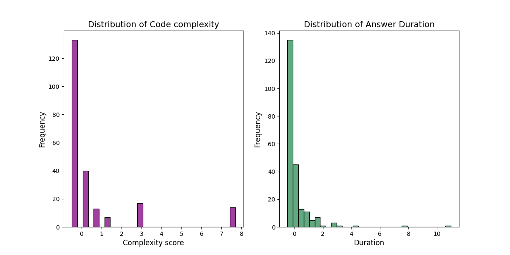
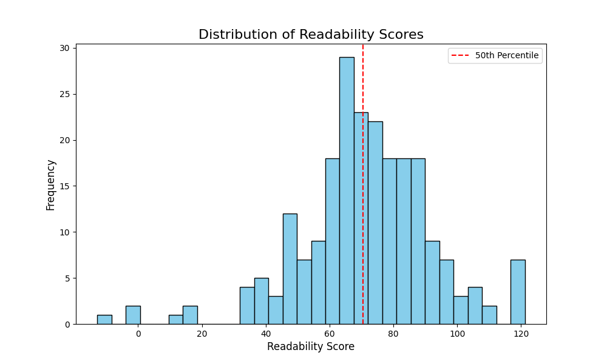
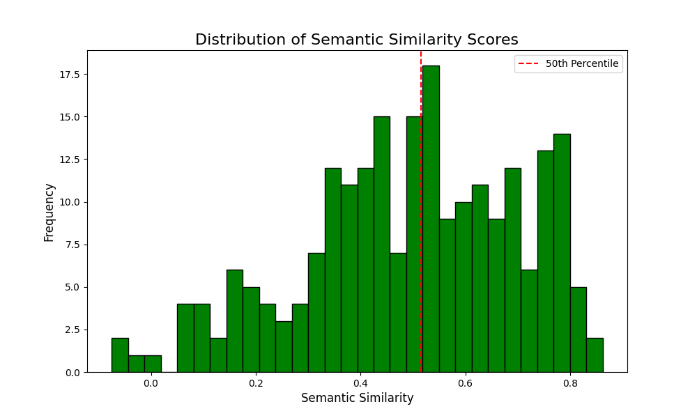
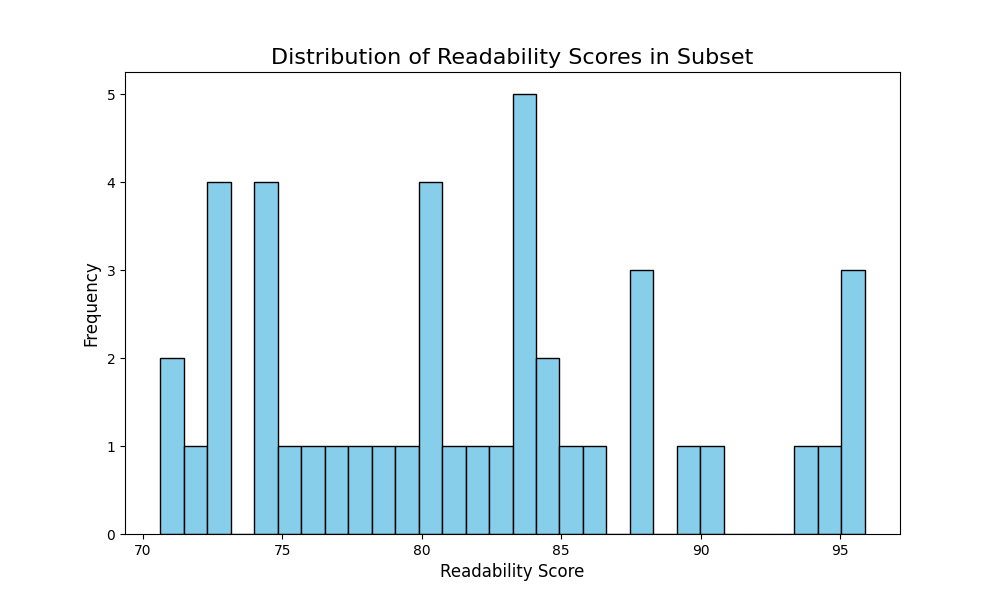
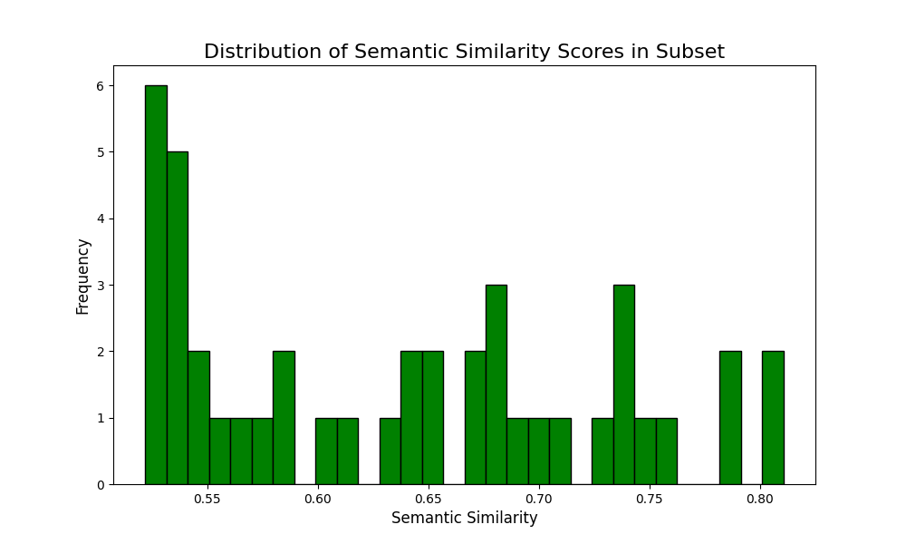
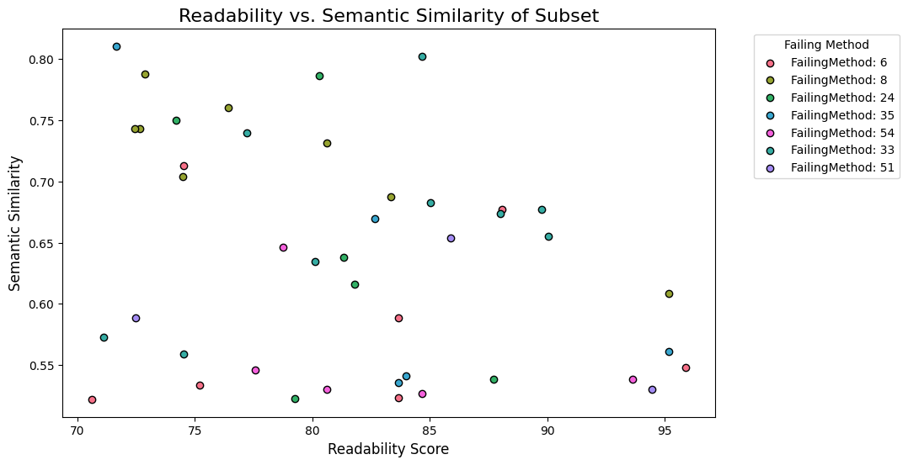
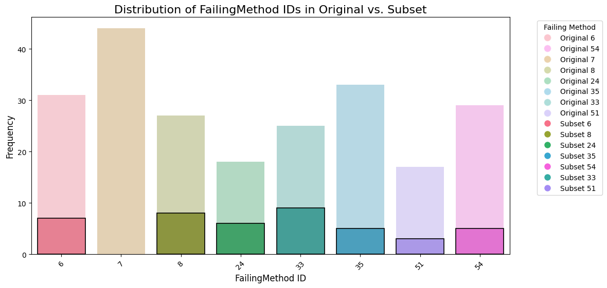
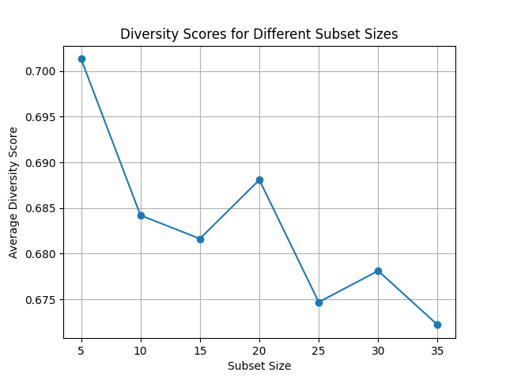

## Task 03
**Question 3.1 :** how would you measure diversity? E.g., entropy of each feature

There are different metrics to determine the diversity of a dataset. As we want this metric to be based on the demographics of the study participants and the answer attributes, we do not consider the *Answer.explanation* feature itself, readability, or semantic similarity score at this point (see 3.2 and 3.3 how these are considered when determining the subset).

In our dataset, this results in 148 remaining features. Of these 148 features, only 13 features are individual features (ordinal, numerical, encoded categorical features). The other features were originally two features (*"Worker.whereLearnedToCode", "Worker.programmingLanguage"*) that were then one-hot-encoded.   

Due to the nature of our data, we choose two different metrics for the one-hot-encoded and remaining features and weight them. As the one-hot encoded columns represent two features from our original dataset, their weight is equal to 2/15~0.13. 
- weight_one_hot_encoded_features = 0.13
- weight_numerical_features = 0.87

For the one-hot-encoded features we use the Jaccard similarity to assess diversity among the one-hot encoded features. This metric directly computes the proportion of shared active features between pairs of data instances. In other words: it measures how similar the values of the one-hot-encoded rows are. The result is an interpretable measure of overlap - the higher the score, the higher the overlap. We treat this overlap as an approximation towards diversity by computing the Jaccard diversity score as 1 - Jaccard similarity.

For the remaining features, we choose entropy as a simple way to measure how uniformly the values are distributed. The higher the entropy, the more diverse we consider the subset to be. 

Diversity_total = weight_numerical_features * entropy_score + weight_one_hot_encoded_features * Jaccard_diversity_score 

​For the dataset that we obtained in mini project 02, this results in the following scores: 

``` Feature Entropy for non-hot-encoded features:

Normalized Feature Entropy for non-hot-encoded features:
FailingMethod: 0.679
Answer.duration: 0.230
Answer.confidence: 0.864
Answer.difficulty: 0.973
Answer.order: 0.927
Code.LOC: 0.546
Code.complexity: 0.470
Worker.score: 0.921
Worker.profession: 0.888
Worker.yearsOfExperience: 0.713
Worker.age: 0.783
Worker.gender: 0.758
Worker.country: 0.610

Entropy Score averaged: 0.72

Jaccard Similarity for one-hot-encoded features: 0.38
Jaccard Diversity: 0.62

Final Weighted Diversity Score: 0.71
````

The metrics show that the entropy-based diversity is rather high for most features. However, it is low (<0.50) for the code complexity and the duration needed to answer a question. This observation is true to our data as the plots below show. Both distributions are highly skewed. The diversity of the one-hot-encoded features is also rather high. This was to be expected due to our approach to one-hot-encoding where many columns were created. To get a better estimate in future projects, we would suggest to use an llm to consolidate answers further first, one-hot-encode next, and lastly derive the diversity based on fewer consolidated columns. 



_____
**Question 3.2 :** what is the max readability and semantic similarity independent of the
diversity?

As introduced in Task 2, we use the Flesch-Reading-Score for readability, and the cosine similarity for semantic similarity rating. However, in this task, we calculate both scores for each data entry. This is equivalent to one readability and one semantic similarity score per row. We calculate these scores based on the *Answer.explanation* column of our preprocessed dataframe from mini project 02. We only take correct answers given (*TP==1*) into account. 

To determine our max values, we set a threshold for the 0.5 quantile for each score:

- threshold_readability_0.5 = 70.55
- threshold_semantic_similarity_0.5 ≈ 0.52

 As a result, we obtain a subset with 43 entries where both scores are >= the 0.5 quantiles.







 The graphic below shows the distributions of data entries based on the readability and semantic similarity scores. It pictures that, for example, those entries with high readability scores were not included in the subset. Further investigation has shown that this is indeed a desired behaviour. Due to the nature of the readability score calculation, higher scores are also obtained, if only few (e.g. one word) are given in the *Answer.explanation* column. By combining the semantic of the answer given, this bottleneck can be avoided. 




The colours of the data points signify the different bug IDs (*FailingMethod*). We can see that the highest scores are distributed across the different IDs and do not seem to be dependent on one ID only. To get a better understanding of the subset according to the IDs, we can refer to the following plot. The plot shows the count of correct entries by FailingMethod / Bug ID of the subset and original dataset. We can see that ID 7 is not part of the subset while it has the highest count in the original dataset. The reason for this is plausibly that we have used different prompts of ground truth generation. As a result, for bug ID 7, the ground truth is a multi-step list that explains how to fix the bug. In comparison, ID 33 has the highest share of entries in the subset. Here, the ground truth explanation is a crisp and short description of the bug. Both ground truth entries can be found below.  This effect highlights the importance of prompting and ground truth generation. As we want to proceed with our work based on the results from mini project 02, we will nonetheless continue with this subset that excludes ID 07. 


  

___

```
** Ground Truth ID Failing Method 7 **

1. Incorrect Index Usage in Data Retrieval:
Variables s (start time) and e (end time) are initialized using this.minMiddleIndex (e.g., lines 299, 301) instead of this.maxMiddleIndex in getDataItem() calls. This leads to incorrect calculation of maxMiddleIndex and assertion failures.

2. Method Signature Mismatch:
TimePeriodValues.add() is called with two parameters (e.g., SimpleTimePeriod and double), but the method expects a single TimePeriod argument, causing compilation/runtime errors.

3. Uninitialized/Unupdated Count Variable:
A test asserts count equals 1, but count is initialized to 0 and never modified, resulting in assertion failures. Another note suggests the expected value should be 3 instead of 1.

4. Division by Zero Risk:
Calculation (e - s) / 2 (or similar) may involve division by zero if e == s, though exact context is unspecified.

5. Type Mismatch in Method Calls:
updateBounds() is called with an int parameter where a different type (e.g., TimePeriod) might be expected, causing type errors.

6. Variable Confusion in Middle Calculation:
Variable e in maxMiddle calculation references this.minMiddleIndex (line 301) instead of this.maxMiddleIndex, skewing results.
```

```
** Ground Truth ID Failing Method 33 **

A NullPointerException occurs on line 910 when iterating through an array. The code dereferences array[i] (via getClass()) without checking if the element is null. Specifically, if array[i] is null (e.g., the second element in the test input), calling getClass() throws the 
exception. The loop lacks a null check before accessing the method.

```

____


**Question 3.3 :** what is the max diversity for (previously achieved) max semantic similarity ?
( compromising readability)


In this task, we want to find the number of entries in our subset (i.e. a subset of the subset) that maximizes diversity. We assume that this maximization can only be reached by optimizing the number of entries (rows), not the number of features (columns), i.e. we consider our number of features fixed.

In the previous task 3.2, we have created a subset of our original dataset that satisfies both thresholds for readability and semantic similarity. This subset consists of 43 entries where all readability and semantic similarity scores are above their 0.5 quantile. Based on this subset, we optimize the diversity by applying the diversity score calculations form task 3.1. Therefore, we sample random subsets of our 43-sample-subset in an iterative approach. We sample 100 times for different number of samples ([5, 10, 15, 20, 25, 30, 35, length of the subset]) in the new subset. The subset with the highest diversity score is then taken and saved. We have observed that the smaller the subset, the higher the diversity. As we calculate the diversity by comparing the different rows, this is an expected behaviour. An alternative for future projects would be to calculate a diversity metric per row and then take the average of the sampled set. 

The final subset details can be found [here](data/exports/final_data_description.txt). The final subset can be found accessed [here](data/exports/final_subset.csv).



