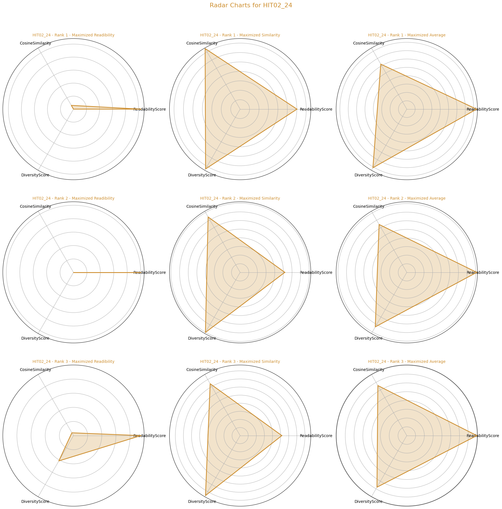
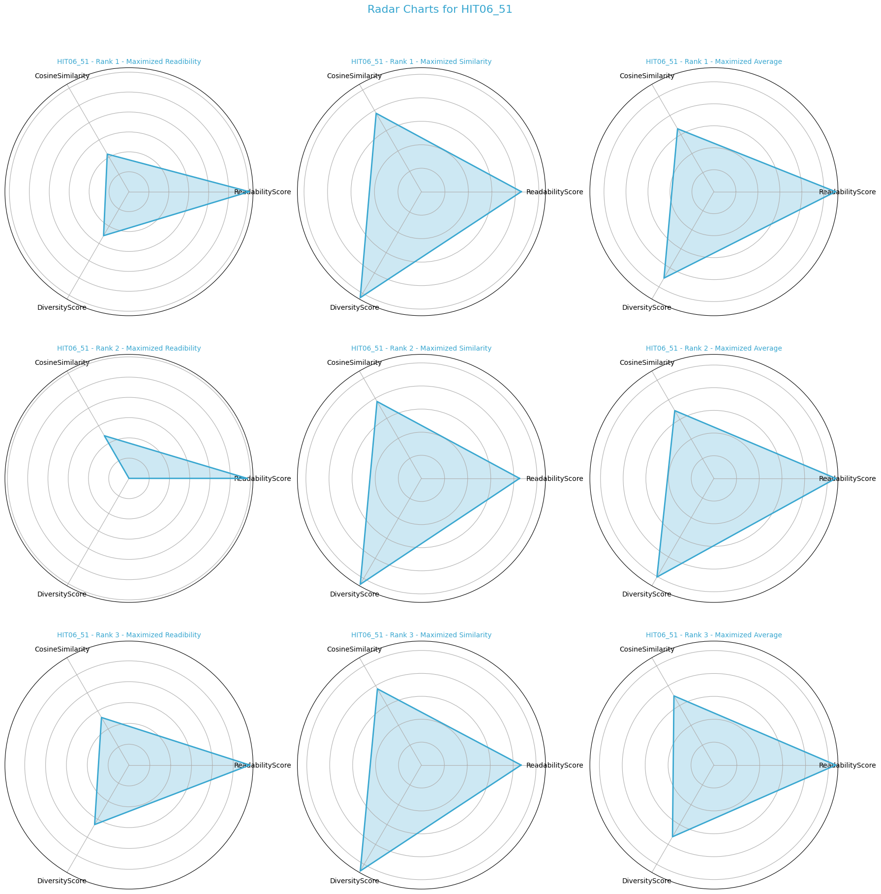

# Report mini project 3, Paul and Silvan

## Task 1 : Distribution shifts

### Implementation

The implementation is the same as in mini project 2 to  make the comparison as fair as possible.

- We first calculate the halstead volume of each explanation
- Then we split into a train and holdout set where entries are chosen based on if there are from FailingMethod "HIT01_8" or "HIT02_24" (holdout_set) or the rest
- We then use "Answer.duration", "Answer.confidence", "Answer.difficulty", "Worker.yearsOfExperience" and "Halstead_volume" to train a Random Forest model
- We use cross-validation and grid search to try to optimize the model

The main difference here to mini project 2 is that the train and holdout set are entirely composed of entries where the "Worker.profession" is either "Graduate_Student" or "Undergraduate_student"

We then measure the precision and recall on the holdout set and then one by one add a random entry from the non-student data-points into the holdout set

### Question 1.1

We never deviate more than 5% to 10% from precision while the recall is constant at 1. This shows that the model has also learned the same behaviour of always predicting 1 that the old model learned, even with this different training data set. Therefore adding non-students to the holdout does not really affect the performance.

### Question 1.2

Since this model from the beginning already exhibits the same behaviour as the original model the minimum number of "Non-Student" to produce similar outcomes as the model from mini project 2 is 0.

## Task 2 : Necessary and Sufficient Explanations

### Implementation

For this tasks we directly use the explanations that are qualified as true positives in the dataset.

We use the entire true positives explanations per method as input for ChatGPT as well as the prompt that had the best (similar) performance in mini project 2 which is:

>We have asked developers to find bugs in software and explain the bug to us. Based on the participants’ explanations, give us one very short explanation of the bug, while keeping the information that would be necessary for someone else to fix the bug. Write it in a way one of the participants would. These are the answers of the participants (one per line):

For our redibility score we use the [Flesch Reading Ease score](https://en.wikipedia.org/wiki/Flesch%E2%80%93Kincaid_readability_tests). Originally we wanted to use Simple Measure of Gobbledygook (SMOG) for the calculation which is a readibility score that is also used in more technical/specific contexts, however it is normed on 30-sentences samples which is obviously not given in our case.

We then settled on Flesch Reading Ease which is an actual score however it might be limited by the fact that it is developed for school books which probably lack the technical complexity present in bug reports. However, for comparing differences among the reports it might still be adequate

Here are the average reading scores of the developer explantions per method

| Method    | Average score |
| -------- | :-------: |
| HIT01_8  | 76.2    |
| HIT02_24  | 67.4    |
| HIT03_6 | 78.8   |
| HIT04_7  | 71.6   |
| HIT05_35  | 87.7    |
| HIT06_51 | 87.1    |
| HIT07_33  | 90.3    |
| HIT08_54  | 97.2    |

The ground truth explanations as well as their readibility go as follows:

| Method    | GT explanation| Average score |
| -------- | :-------: | :-------: |
| HIT01_8  | The bug is on line 279, where minutesOffset is incorrectly checked with if (minutesOffset < 0 \|\| minutesOffset > 59). According to the documentation, minutesOffset should allow values between -59 and 59. The condition should be updated to if (minutesOffset < -59 \|\| minutesOffset > 59) to properly handle negative values when the hour offset is also negative. | 62.9    |
| HIT02_24  | The variable g can become negative due to incorrect handling of input values, specifically when the parameter value (instead of v) is used in the calculation. This negative g is passed to the Color constructor, which expects values between 0–255 (or 0.0–1.0 for floats), causing an IllegalArgumentException. Adding a check to ensure g stays within the valid range or correctly using v in the calculation would fix the issue.    |  57.5    |
| HIT03_6 | The bug is caused by the pos variable being incremented too much, potentially going beyond the length of the input string. This happens because pos is incremented both in the while loop and when handling surrogate pairs, leading to a StringIndexOutOfBoundsException. The issue likely occurs around line 95, where pos may exceed the valid range for the input string.  |  48.2   |
| HIT04_7  | The bug is that the code is incorrectly using minMiddleIndex instead of maxMiddleIndex when calculating values for s and e on lines 299-301. This causes incorrect bounds for maxMiddleIndex. To fix it, replace this.minMiddleIndex with this.maxMiddleIndex in the relevant code lines to correctly retrieve the time period for maxMiddleIndex.  | 38.9   |
| HIT05_35  | The bug occurs when both the array and element parameters are null, causing the type to be set to Object.class. This results in an Object[] array being created instead of the expected String[], leading to a ClassCastException later in the code. To fix this, add a check to throw an IllegalArgumentException when both parameters are null, and ensure the correct type is used for array creation.    |  61.0   |
| HIT06_51 | The bug is due to the incorrect handling of the value as a long type instead of a floating point number. This causes issues with string representation, where the expected value "-0.0" is returned as "0". Additionally, the while loop condition and the handling of non-null string comparisons may also contribute to the problem.    | 70.0    |
| HIT07_33  | The bug occurs when the code attempts to call getClass() on a null element in the array, which results in a NullPointerException. To fix it, add a null check before accessing getClass() on array elements, such as: classes[i] = array[i] == null ? null : array[i].getClass();    |  95.5   |
| HIT08_54  | The bug occurs because the character at position 3 (ch3) is an underscore ('_'), but the code expects it to be a capital letter (A-Z). This triggers an IllegalArgumentException in line 115, where ch3 is checked against the range 'A' to 'Z'. To fix this, the code should handle cases where ch3 is an underscore or non-uppercase character more gracefully.    | 83.9   |  

  

In general, the ground truth explanations seem to be more complicated however this makes sense since the original explanations often highlight issues in the code only partially or not at all.

In terms of similarity score we use [cosine similarity ](https://en.wikipedia.org/wiki/Cosine_similarity) which is a proven and often used metric for document similarity.

| Method    | Average score |
| -------- | :-------: |
| HIT01_8  | 0.33    |
| HIT02_24  | 0.36    |
| HIT03_6 | 0.37   |
| HIT04_7  | 0.30  |
| HIT05_35  | 0.42    |
| HIT06_51 | 0.38    |
| HIT07_33  | 0.38    |
| HIT08_54  | 0.38    |

Overall the similarity of our GT to individual explanations in the dataset seems rather small but can be explained with the same reason as for readibility as well as with the formating ChatGPT is doing to its answer.

We then shuffle each explanation for each method randomly and then add them one by one to the prompt to evaluate readibility and cosine similarity.

### Question 2.1

In terms of thresholds we want to evaluate it goes as follows:
- For readibility we want it to stay between the complexity of the original explanations and the GT since each newly generated explanation has technically less information than GT and more than the developers explanation
- For semantic similarity we want to have at least 0.7 similarity compared to GT to have an acceptable information degree

The results are quite intesting.

For readibility we see that for at least a good portion of the process we are in the zone we defined previously, however in one case (HIT01) we are promonently more readible while for HIT07 we are less readible for the majority of the time.

In term of semantic similarity in all cases we seem to reach the threshols of 0.7. On average this seems to happen about 7.5 explanations. It is however interesting to see that event at the end of each part of the process the similarity is never 1 even if ChatGPT has at taht point seen the excact same information as it has seen for the GT. This for one can be explained by randomness in ChatGPTs outputs but there is also another part to this which comes also into play when looking at the sometimes rather big fluctuations in similarity. ChatGPT seems to overvalue the bottom explanations in the prompt and with explanations such as "Yes", "Think So", "I THINK THIS ANSWERS" but also answers that focus quite detailled on a specific partly aspect of the problem such as "The str variable must be the correct length and start with two lowercase letters; which can be followed by an underscore; two uppercase letters; another underscore; and three lowercase letters. Lines 107 to 126 are validating this with if statements. If the str variable does not meet this criteria; an IllegalArgumentException is thrown. The str varible with a value of fr__POSIX seems to be valid up until line 121 where the if statement checks to see if the 6th character in str in an underscore. Since it is not; an IllegalArgumentException error is thrown with the message Invalid locale format:fr__POSIX", ChatGPTs explanations have a tendency to change drastically.

The entirety of the consolidated explanations can be found in the folder "chatgpt_consolidated_explanations_per_method" where each row stands for one more explanation added.

## Task 3: Diverse Explanations

### Implementation

Our GT explanation is rougly 2-3 times longer as the average explanation from the developers, allowing for some deviations we surmise that 1-5 explanations could have the same information value as a GT explanation.

We generate a dataset for each method that for every possible combination of explanations per method that are 1-5 long concatenates them and then calculates their reading score as well as the semantic similarity towards the GT. We also calculate the average between both scores (with reading score normalized to be between 0 and 1).

From this we filter out the 3 best combination for each type of score (readibility, similarity, average) and then combined them back with the respective entries from the original dataset so that we can link them to the demographic/answer attributes and then calculate the entropy for each of these mini datasets (which can be found in "combined_explanations_and_metrics") as diversity score.

### Question 3.1

We measure diversity by calculating the variety of different values per columns across the explanations used through entropy and then sum it up

### Results

These radar charts highlight the values for the top 3 ranked explanation combinations maximized for either readibility, similarity or the average across both (can be found in top_ranked_dfs).

Looking at the radar charts, it seems quite clear that if readibility is taking into account (either in readibility or in average) the overall score seems to suffer. Meanwhile maximizing cosine similarity seems to maximize overall scores.

For context, the best combinations for:
- Readibility are on average 1.75 explanations long
- Similarity are on average 4.92 explanations long
- Average between both are on average 3.83 explanations long

So it seems like around 5 explanations contain a similar amount information as the GT while readibility aims for very little information

### Question 3.2

The max values for similarity, readibility or maximizing both at the same time for each method can be derived from this table. Here we take the rank 1 entry for each category at look at the metrics

| Method    | Maximized for | Readibility score | Similarity score | Diversity score |
| -------- | :-------: | :-------: | :-------: | :-------: |
| HIT01  | Readibility   | 141.6 | 0.03 | 0.0|
|   | Similarity    | 70.6 | 0.76 | 18.2 |
| | Average across both  | 97.8 | 0.72 | 0.0 |
| HIT02  | Readibility   | 103.4 | 0.07 | 0.0|
|   | Similarity    | 60.1 |  0.74 | 22.9 |
| | Average across both  | 83.4 | 0.62 | 25.4 |
| HIT03  | Readibility   | 160.4 | 0.0| 0.0|
|   | Similarity    | 66.6 |  0.80 | 30.0 |
| | Average across both  | 100.0 | 0.67 | 26.7 |
| HIT04  | Readibility   | 205.8 | 0.0| 0.0|
|   | Similarity    | 39.0 |  0.77 | 27.7 |
| | Average across both  | 205 |  0.0 | 0.0 |
| HIT05  | Readibility   | 151.3 | 0.04| 0.0|
|   | Similarity    | 74.0 |  0.82 | 28.8 |
| | Average across both  | 115.0 |  0.71 | 19.7|
| HIT06  | Readibility   | 120.6 | 0.43|16.0|
|   | Similarity    | 85.0 |  0.77 | 32.7 |
| | Average across both  |  110.6 | 0.66 | 28.5|
| HIT07  | Readibility   |  135.265 | 0.36|0.0|
|   | Similarity    | 97.5 |  0.77 | 26.5 |
| | Average across both  |  119.6 | 0.65 |  22.9|
| HIT08  | Readibility   |  156.6 | 0.24|0.0|
|   | Similarity    |  123.4 |  0.76 | 27.7 |
| | Average across both  |  119.6 | 0.66 |  31.3|

Across all the maximazition variants these are the averages:

| Maximized for    | Average readibility score | Average similarity score | Average diversity score |
| -------- | :-------: | :-------: | :-------: |
| Readibility  | 146.8   | 0.14 | 2.0|
| Similarity  | 72.9  | 0.77 | 26.8|
| Average across both  |  119.4   | 0.58 | 19.3|

In total the maximal values are as follows:
- Readibility : 205.8
- Cosine Similarity: 0.82

### Question 3.3

Just looking at the 3 top ranked combinations for semantic similarity the following table shows the values of the metrics for the entry with highest diversity score.

| Method    | Average readibility score | Average similarity score | Average diversity score |
| -------- | :-------: | :-------: | :-------: |
| HIT01  | 75.4  | 0.75 | 29.0|
| HIT02  | 51.4   | 0.73 |  26.8|
| HIT03  | 66.6   | 0.80 | 30.0|
| HIT04  | 40.9  | 0.77 | 28.8|
| HIT05  | 74.0   | 0.82 | 28.8|
| HIT06  | 86.8   |  0.76 |  33.4|
| HIT07  | 98.8   | 0.76 | 28.8
| HIT08  | 89.8   | 0.76 | 28.3|

With the maximal diversity value being 33.4.

